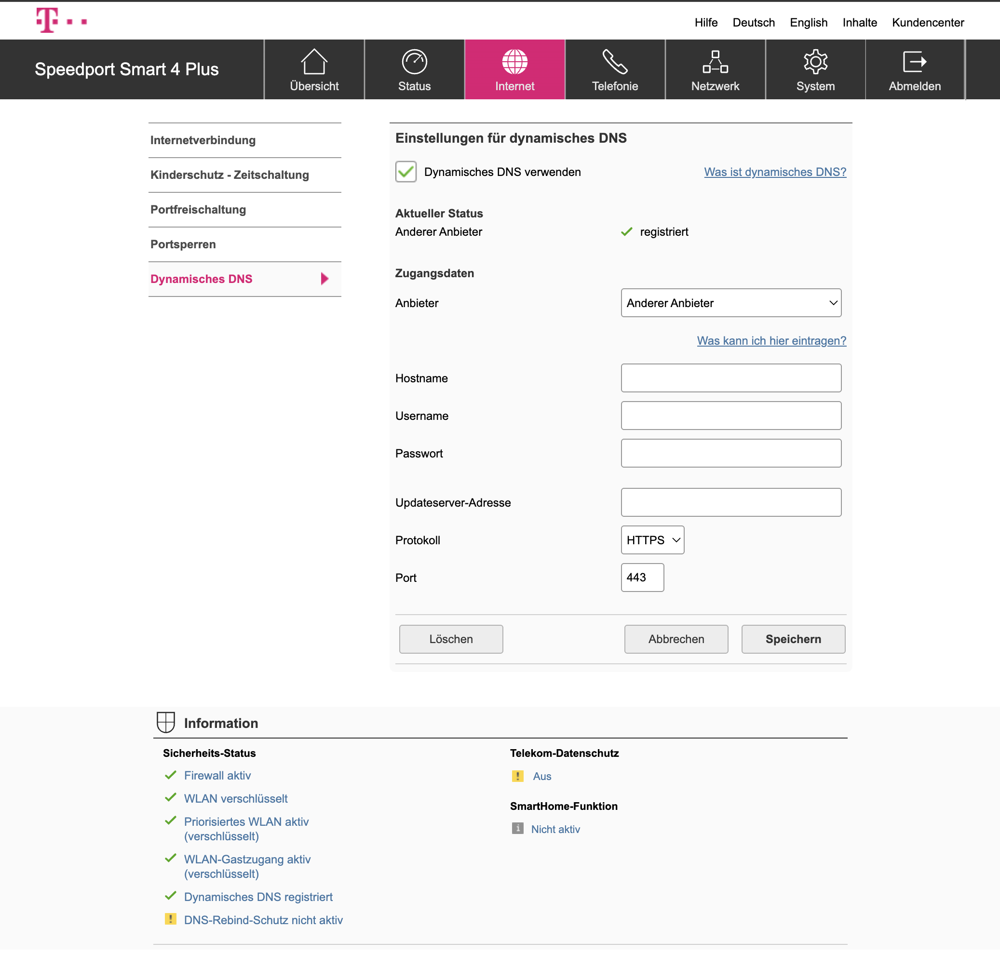

# DynDNS v2 on AWS Lambda (Cloudflare backend) for Telekom Speedport 4

[](LICENSE)

This project provides a DynDNS v2-compatible update endpoint that accepts Basic Auth (`username:password`) and updates a Cloudflare DNS record.

## What it supports

- DynDNS-style endpoint: `GET /nic/update`
- Basic auth with configured credentials
- Query parameters:
  - `hostname` (required, single hostname)
  - `myip` (optional, falls back to source IP)
- DynDNS-style responses:
  - `good <ip>` when updated or created
  - `nochg <ip>` when no update was needed
  - `badauth`, `notfqdn`, `nohost`, `numhost`, `dnserr`, `911`

Notes:

- `myip` supports comma-separated IPv4 and IPv6 values.
- Multiple hostnames still return `numhost`.
- Cloudflare record type is chosen automatically based on the IP version.

## Prerequisites

- AWS account with IAM permissions for Lambda, API Gateway, CloudFormation, S3, and Systems Manager Parameter Store
- AWS SAM CLI
- Node.js 24+
- Cloudflare API token with DNS edit permission for the target zone
- Optional: `aws-vault` for secure AWS credential management and profile-based deployment

## Configuration

This repo supports two deployment workflows:

1. `.envrc`-driven configuration
2. direct environment variables

### Recommended `.envrc` + `.envrc.local` setup

Store repository-specific settings in `.envrc`, and keep secret or machine-specific values in `.envrc.local`.

Example `.envrc`:

```bash
export AWS_REGION='your-aws-region'
export STACK_NAME='your-stack-name'
export CF_ZONE_ID='your-cloudflare-zone-id'
export LAMBDA_EXEC_ROLE_ARN='arn:aws:iam::123456789012:role/your-lambda-role'
export CFN_EXEC_ROLE_ARN='arn:aws:iam::123456789012:role/your-cfn-role'
export ALLOWED_HOSTNAMES='your-hostname.example.com'
export CF_PROXIED='false'

export DDNS_SECRET_NAME='/dynamoody/dyndns-auth'
export CLOUDFLARE_SECRET_NAME='/dynamoody/cloudflare'

if [[ -f .envrc.local ]]; then
  source .envrc.local
fi
```

Example `.envrc.local`:

```bash
export DDNS_USERNAME='your-ddns-username'
export DDNS_PASSWORD='your-ddns-password'
export CF_API_TOKEN='your-cloudflare-api-token'
```

Because `.envrc.local` contains secrets, keep it out of version control with `.gitignore`.

The deploy helper reads the parameter names and optional raw values from the active environment after `source .envrc`.

## Secrets

This app stores credentials in AWS Systems Manager Parameter Store as SecureString values.

### Default parameter names

- `DDNS_SECRET_NAME` default: `/dynamoody/dyndns-auth`
- `CLOUDFLARE_SECRET_NAME` default: `/dynamoody/cloudflare`

### Parameter values

- DynDNS auth parameter must contain JSON with:
  - `username`
  - `password`
- Cloudflare token parameter must contain the raw token string

If you already have parameters, set `DDNS_SECRET_NAME` and `CLOUDFLARE_SECRET_NAME` to those names and omit the raw values.

## Deploy

### Option A: deploy from `.envrc`

When `.envrc` contains your values, run:

```bash
direnv allow   # if you use direnv
source .envrc
./scripts/bootstrap-from-env.zsh
./scripts/deploy.zsh
```

This creates or updates the named SSM SecureString parameters and bootstraps the IAM roles used by CloudFormation.

### Using aws-vault

If you store AWS credentials in `aws-vault`, use it to execute the scripts with a profile instead of exporting raw AWS keys:

```bash
aws-vault exec admin -- zsh -lc 'source .envrc && ./scripts/bootstrap-from-env.zsh'
aws-vault exec admin -- zsh -lc 'source .envrc && ./scripts/deploy.zsh'
```

If you prefer the direct env workflow, wrap the deploy command similarly:

```bash
aws-vault exec admin -- sh -lc 'export AWS_REGION=your-aws-region; export STACK_NAME=your-stack-name; export CF_ZONE_ID=your-cloudflare-zone-id; export LAMBDA_EXEC_ROLE_ARN=arn:aws:iam::123456789012:role/your-lambda-role; export CFN_EXEC_ROLE_ARN=arn:aws:iam::123456789012:role/your-cfn-role; export DDNS_SECRET_NAME=/dynamoody/dyndns-auth; export CLOUDFLARE_SECRET_NAME=/dynamoody/cloudflare; export DDNS_USERNAME=your-ddns-username; export DDNS_PASSWORD=your-ddns-password; export CF_API_TOKEN=your-cloudflare-api-token; ./scripts/deploy.zsh'
```

Using `aws-vault` keeps AWS credentials encrypted in the OS keychain and prevents long-lived IAM keys from leaking into shell history or environment files.

### Option B: deploy with direct environment variables

If you prefer not to use `.envrc`, export only the values you need:

```bash
export AWS_REGION='your-aws-region'
export STACK_NAME='your-stack-name'
export CF_ZONE_ID='your-cloudflare-zone-id'
export LAMBDA_EXEC_ROLE_ARN='arn:aws:iam::123456789012:role/your-lambda-role'
export CFN_EXEC_ROLE_ARN='arn:aws:iam::123456789012:role/your-cfn-role'
export ALLOWED_HOSTNAMES='your-hostname.example.com'
export CF_PROXIED='false'

export DDNS_SECRET_NAME='/dynamoody/dyndns-auth'
export CLOUDFLARE_SECRET_NAME='/dynamoody/cloudflare'
export DDNS_USERNAME='your-ddns-username'
export DDNS_PASSWORD='your-ddns-password'
export CF_API_TOKEN='your-cloudflare-api-token'

./scripts/deploy.zsh
```

The deploy helper will create or update the secrets and then deploy the SAM stack.

## Verify deployment

After deploy, the script prints the `EndpointUrl`.

Use the endpoint like this:

```bash
curl -u "your-ddns-username:your-ddns-password" "${ENDPOINT}?hostname=your-hostname.example.com&myip=203.0.113.42"
```

Expected responses:

- `good 203.0.113.42`
- `nochg 203.0.113.42`

## Speedport 4 compatibility

This endpoint is compatible with Speedport 4 routers because it implements the standard DynDNS v2 update flow:

- HTTP GET with `hostname`
- optional `myip`
- HTTP Basic Auth for username/password

On Speedport 4, configure the router's DynDNS provider to use the deployed `EndpointUrl` as the update URL, with your DynDNS credentials.



## Local testing

Run the handler syntax check and unit tests locally:

```bash
node --check src/handler.mjs
npm test
```

The unit tests mock AWS Systems Manager Parameter Store and expect `DDNS_AUTH_PARAM_NAME` and `CF_API_TOKEN_PARAM_NAME` to be set, matching the Lambda handler contract.

## Notes

- If `myip` is omitted, the handler falls back to the request source IP.
- `DDNS_ALLOWED_HOSTNAMES` is recommended to restrict updates to allowed hostnames.
- `CF_PROXIED=true` makes Cloudflare DNS records proxied by default.
- Secrets are resolved at deploy time via CloudFormation dynamic references.
- If you rotate the Cloudflare token or DynDNS credentials, rerun `./scripts/deploy.zsh` so the Lambda environment refreshes.

## License

This project is licensed under the MIT License. See [LICENSE](LICENSE) for details.
